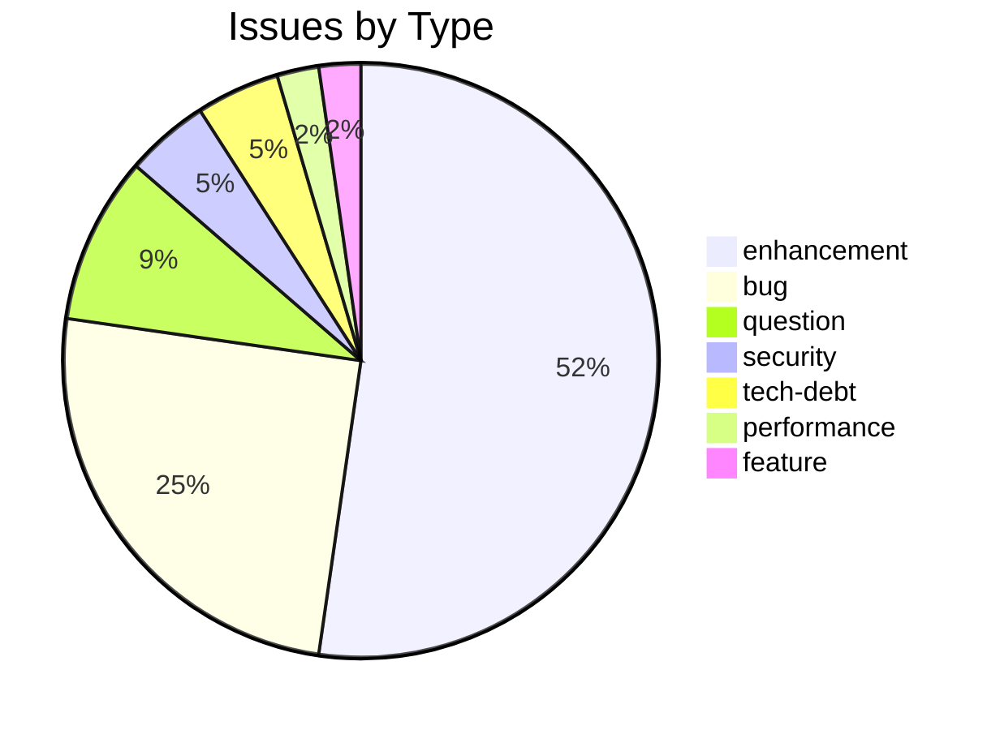
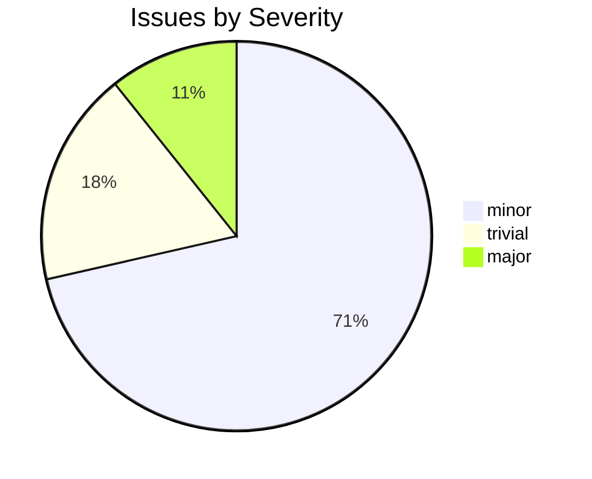

# csl-apidev

_Created: 06-08-2018 · Last updated: 05-07-2026_

CDSL **web-backend** repository in the Sanskrit Lexicon project.

<!-- BEGIN MANUAL: documentation — hand-maintained; the Cologne Tooling Runbook preserves everything between these markers verbatim across README regeneration. Do not remove the markers. -->
## Documentation

API endpoint docs live in [`doc/`](doc/readme.md). Of note:

- **Salt API** — a [C-SALT](https://api.c-salt.uni-koeln.de)-compatible REST + GraphQL
  interface over the existing dictionary data, so a client written for the C-SALT APIs
  uses the same endpoint shapes against `sanskrit-lexicon.uni-koeln.de`, with Phase 1
  caveats documented in the Salt specs. Endpoint specs:
  [`salt_entries`](doc/salt_entries.md), [`salt_ids`](doc/salt_ids.md),
  [`salt_graphql`](doc/salt_graphql.md); Phase 1 controller skeleton in
  [csl-apidev#46](https://github.com/sanskrit-lexicon/csl-apidev/pull/46). The normative
  contract, schemas, and roadmap live in
  [csl-standards#2](https://github.com/sanskrit-lexicon/csl-standards/pull/2).
- [Clean-URL permalinks roadmap](doc/cleanurl.md) — path-based direct links to
  dictionary entries, e.g. `/MW/bAQa` or `/MW/144239`
  ([COLOGNE#249](https://github.com/sanskrit-lexicon/COLOGNE/issues/249)); the HTML and
  collision-safe-routing face of the Salt permalink.
- **Unified web interface** ([`app/`](https://github.com/sanskrit-lexicon/csl-apidev/blob/main/app/README.md)) —
  the redesigned front end that consolidates the classic Basic / List / Advanced /
  Mobile / Simple pages into one responsive search, plus a catalogue homepage and
  dictionary-detail route. Implements the ruled **Proposal A (Research Workbench)**;
  design docs in [`doc/ux-redesign/`](https://github.com/sanskrit-lexicon/csl-apidev/tree/main/doc/ux-redesign).
  Additive layer, existing endpoints and production URLs unchanged.
<!-- END MANUAL: documentation -->

## Example request

The Salt API's live entry-point is [`api1/salt_entries.php`](api1/salt_entries.php),
documented in [`doc/salt_entries.md`](doc/salt_entries.md). A real,
already-verified request (checked live against `sanskrit-lexicon.uni-koeln.de`
per the doc):

```
https://sanskrit-lexicon.uni-koeln.de/dicts/mw/restful/entries?field=headword_slp1&query=agni&query_type=term
```

which returns the C-SALT-compatible JSON envelope the controller builds —
`salt_entries.php` wraps the existing `getword` data as `{"data":{"entries":[...]}}`
(see the handler in [`api1/salt_entries.php`](api1/salt_entries.php) lines 15–18).
The permalink form of the same lookup:

```
https://sanskrit-lexicon.uni-koeln.de/MW/agni        # by headword
https://sanskrit-lexicon.uni-koeln.de/MW/144239       # by lnum
```

`field` also accepts `id`, `sense`, `re_headwords_slp1`, `created`, `xml`; `query_type`
accepts `term`, `fuzzy`, `match`, `match_phrase`, `prefix`, `wildcard`, `regexp`
(Phase 1 implements `headword_slp1`/`term` only — see the doc for the full parameter table).

## Issues Overview

**Total**: 45 | **Open**: 22 | **Closed**: 23

### By Milestone

| Milestone | Open | Closed | Total |
|---|---|---|---|
| Unassigned | 22 | 23 | 45 |

### By Type



### By Severity



## GitHub Issue Conventions

Follows the [Cologne tooling-repo taxonomy](https://github.com/sanskrit-lexicon/csl-observatory/blob/main/runbook/cologne-tooling-runbook.md):

- **9 type labels**: bug, feature, enhancement, performance, tech-debt, security, documentation, infrastructure, question
- **4 severity levels**: trivial, minor, major, critical
- **5 milestones**: API Stability, User Experience, Data Quality, Developer Experience, Community
- **Org Project**: [Tooling Roadmap](https://github.com/orgs/sanskrit-lexicon/projects/9)

See [CLAUDE.md](CLAUDE.md) for full definitions.

---
*Generated by Cologne Tooling Runbook on 2026-05-15*

_Dr. Mārcis Gasūns_
