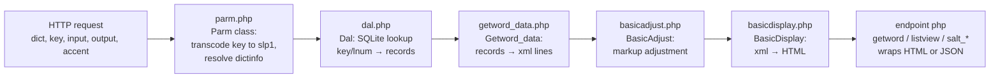

# csl-apidev — Web Backend Operator Manual

_Created: 28-07-2026 · Last updated: 28-07-2026_

The one-stop operator runbook for [csl-apidev](https://github.com/sanskrit-lexicon/csl-apidev) —
the CDSL **web backend**: plain-PHP dictionary endpoints (`getword`, `listview`, `servepdf`,
`salt_entries`, …), scan/PDF serving, the Salt/C-SALT API surface, and the Python/JS tooling
behind `sanskrit-lexicon.uni-koeln.de`. This manual is the **map + runbook**, not a second
copy of the per-endpoint essays: the canonical endpoint specs live in
[doc/](https://github.com/sanskrit-lexicon/csl-apidev/blob/main/doc/readme.md) and are
indexed from §4 here. Read this file to *run, extend, and fork-sync* the backend without
tribal knowledge; follow the links when you need the full contract of one endpoint.

Audience: a new operator or agent session with PHP available and no prior contact with the
Cologne stack. Handoff provenance: [H1784](https://github.com/gasyoun/Uprava/blob/main/handoffs/H1784-Fable_csl-apidev_web-backend-operator-manual_28.07.26.md);
sibling manuals cover the frontend twin ([csl-websanlexicon](https://github.com/sanskrit-lexicon/csl-websanlexicon), H1782)
and the dictionary-generation pipeline (csl-pywork, H1783).

---

## 1. Cheat-sheet

The ten things you actually need, before any theory:

| # | Task | Command / URL |
|---|---|---|
| 1 | Lint every first-party PHP file the way CI does | `php -l <file>` (hard gate; see §9) |
| 2 | Smoke-test the Salt API locally (needs data, §5.2) | `php api1/salt_selftest.php mw agni indra ka` — run from the **repo root** |
| 3 | Serve the whole repo locally | `php -S 127.0.0.1:8099 -t /path/to/csl-apidev` |
| 4 | Open the unified search UI offline (no server, no data) | `http://127.0.0.1:8099/app/index.php?fixtures=1` |
| 5 | Look a word up on the live host (entry pane only) | `https://www.sanskrit-lexicon.uni-koeln.de/scans/awork/apidev/getword.php?dict=mw&key=harika&input=slp1&output=iast` |
| 6 | Live Salt REST search | `https://sanskrit-lexicon.uni-koeln.de/dicts/mw/restful/entries?field=headword_slp1&query=agni&query_type=term` |
| 7 | Serve a scan page | `https://www.sanskrit-lexicon.uni-koeln.de/scans/awork/apidev/servepdf.php?dict=mw&page=1234` (`&api=1` → JSON, WebFetch-readable even when your IP is 429-throttled) |
| 8 | Check fork drift against csl-websanlexicon | `/cologne-fork-sync-check` (skill), or diff the three §7 files by hand |
| 9 | Check whether the Cologne host is even up before probing | [Uprava/SERVER_OUTAGES.md](https://github.com/gasyoun/Uprava/blob/main/SERVER_OUTAGES.md) — do **not** re-probe a known-down host |
| 10 | JS regression check (CI hard gate) | `node --check app/app.js && node app/rowSlp1.check.js` |

Standing cautions, learned the hard way:

- **The live host rate-limits aggressively.** Space live probes ≥ 10 s (bursts get HTTP 429
  or TLS kills); one polite `curl -sI --max-time 15` liveness check first, always (§10).
- **The repo directory must be literally named `csl-apidev`** for local data resolution
  (`dictinfo::get_webPath()` derives the xampp path from the basename) — a worktree named
  `csl-apidev-h1784-12345` will not find `../mw/web/sqlite/` (§5.2).
- **Never edit `basicadjust.php` / `basicdisplay.php` / `getword_data.php` here first** —
  they are hand-synced forks owned by csl-websanlexicon (§7).

## 2. Anatomy — what lives where

| Path | What it is |
|---|---|
| repo root `*.php` | The classic RESTful endpoints (§4) + their `*Class.php` implementations + shared plumbing: [parm.php](https://github.com/sanskrit-lexicon/csl-apidev/blob/main/parm.php) (parameter parsing), [dal.php](https://github.com/sanskrit-lexicon/csl-apidev/blob/main/dal.php) (data access), [dictinfo.php](https://github.com/sanskrit-lexicon/csl-apidev/blob/main/dictinfo.php) (per-dictionary metadata + path resolution), [dictinfowhich.php](https://github.com/sanskrit-lexicon/csl-apidev/blob/main/dictinfowhich.php) (Cologne-vs-xampp server detection), [security_headers.php](https://github.com/sanskrit-lexicon/csl-apidev/blob/main/security_headers.php) (§9) |
| [api1/](https://github.com/sanskrit-lexicon/csl-apidev/tree/main/api1) | The Salt / C-SALT-compatible controllers (§6): `salt_entries.php`, `salt_ids.php`, `salt_graphql.php`, shared `salt_common.php`, CLI `salt_selftest.php` |
| [api0/](https://github.com/sanskrit-lexicon/csl-apidev/tree/main/api0) | An older JSON-API prototype generation (`hws0.php` headword search, `getsuggest.php`, `servepdf.php` wrappers setting `$_REQUEST['api0']`). Kept working, not the current API direction |
| [app/](https://github.com/sanskrit-lexicon/csl-apidev/blob/main/app/README.md) | The unified redesigned front end (Proposal A "Research Workbench"): one responsive search + catalogue homepage + dictionary detail + SSR entry permalinks (`entry.php`) with JSON-LD. Own README with run instructions |
| [lookup/](https://github.com/sanskrit-lexicon/csl-apidev/tree/main/lookup) | Modern global citation lookup (dalglob v2, waves per [doc/roadmap_lookup.md](https://github.com/sanskrit-lexicon/csl-apidev/blob/main/doc/roadmap_lookup.md)); replaces the 2016-era `sample/dalglob1.php` pattern that caused 429 bursts |
| [simple-search/](https://github.com/sanskrit-lexicon/csl-apidev/tree/main/simple-search) | The forgiving-spelling search engine (v1.0/v1.1 frozen, v1.2 roadmap + eval harness + DCS frequency data). Its own readme + `roadmap_v1.2.md` + `roadmap_dh.md` are the deep docs |
| [doc/](https://github.com/sanskrit-lexicon/csl-apidev/blob/main/doc/readme.md) | Per-endpoint specs and roadmaps — the canonical endpoint documentation this manual indexes (§4) |
| [doc/ux-redesign/](https://github.com/sanskrit-lexicon/csl-apidev/tree/main/doc/ux-redesign) | Design rulings (R1–R8), UI spec, 4 design prototypes, SEO plan, review findings |
| [utilities/](https://github.com/sanskrit-lexicon/csl-apidev/tree/main/utilities) | [transcoder.php](https://github.com/sanskrit-lexicon/csl-apidev/blob/main/utilities/transcoder.php) + the `X_Y.xml` transliteration tables ([doc/transcoder.md](https://github.com/sanskrit-lexicon/csl-apidev/blob/main/doc/transcoder.md)) |
| [scripts/](https://github.com/sanskrit-lexicon/csl-apidev/tree/main/scripts) | `build_sitemap.py` — SEO sitemap shards from `hwnorm1c.sqlite` |
| [reports/](https://github.com/sanskrit-lexicon/csl-apidev/tree/main/reports) | Measured reports, e.g. [salt_parity_mw_2026-07.md](https://github.com/sanskrit-lexicon/csl-apidev/blob/main/reports/salt_parity_mw_2026-07.md) (C-SALT parity + the `input`-default bug) |
| `phpquery/`, `htmlwork/`, `httpwork/`, `sample/`, `monier1list/`, `pwkvn/`, `frontend/` | Vendored library (phpquery — CI-skipped), scratch/legacy work areas, old samples. Read-only archaeology; do not build on them |
| [.ai_state.md](https://github.com/sanskrit-lexicon/csl-apidev/blob/main/.ai_state.md) | The cross-session journal — read its `@WAITING` rows before assuming anything live-server-side is doable today |

On the Cologne server this repo is checked out at `scans/awork/apidev` (softlink
`scans/csl-apidev`), which is why every live URL starts with
`https://www.sanskrit-lexicon.uni-koeln.de/scans/awork/apidev/` — see
[doc/readme.md](https://github.com/sanskrit-lexicon/csl-apidev/blob/main/doc/readme.md).

## 3. Data flow — one request, end to end

Every classic endpoint follows the same chain (the Salt controllers wrap the same chain in
a JSON envelope):



Key facts about the chain:

- **slp1 is the lingua franca.** `Parm` transcodes the incoming `key` from the `input`
  scheme to SLP1 before any lookup; `output` only affects display. Recognized schemes and
  the FSM machinery: [doc/transcoder.md](https://github.com/sanskrit-lexicon/csl-apidev/blob/main/doc/transcoder.md).
  Parameter semantics (incl. the `output`/`filter` and `input`/`transLit` synonym pairs,
  `lnum`-beats-`key` precedence): [doc/restfulparm.md](https://github.com/sanskrit-lexicon/csl-apidev/blob/main/doc/restfulparm.md).
- **Data comes from per-dictionary SQLite** files resolved by
  [dictinfo.php](https://github.com/sanskrit-lexicon/csl-apidev/blob/main/dictinfo.php)
  relative to the server layout (§5.2), with
  [dictinfowhich.php](https://github.com/sanskrit-lexicon/csl-apidev/blob/main/dictinfowhich.php)
  deciding Cologne-vs-local. `lnum` is the per-record Cologne id; it is line-derived and can
  shift on regeneration (headword permalinks outlive lnum permalinks — see
  [doc/cleanurl.md](https://github.com/sanskrit-lexicon/csl-apidev/blob/main/doc/cleanurl.md) §9).
- **The three middle files are forked** from csl-websanlexicon (§7). `BasicDisplay`
  `exit(1)`s on a malformed info string — a hard mid-request death, which is why the Salt
  smoke test treats a fatal as "parser hit an unhandled source shape, pause deployment".
- **Middle-chain classes read `$_REQUEST` state** (e.g. `Getword_data(false)` is driven via
  `$_REQUEST` save/restore in the Salt controllers) — an inherited design; when embedding
  the chain in a new controller, copy the save/restore pattern from
  [api1/salt_common.php](https://github.com/sanskrit-lexicon/csl-apidev/blob/main/api1/salt_common.php)
  rather than inventing a new one.

## 4. Endpoint catalogue

Everything is **public, unauthenticated, CORS-open** — there is no auth layer anywhere in
this repo; abuse control is the host's per-IP rate limiting (§10). Base URL for the classic
endpoints: `https://www.sanskrit-lexicon.uni-koeln.de/scans/awork/apidev/`.

| Endpoint | Purpose | Canonical doc | Notes |
|---|---|---|---|
| `listview.php` | Full two-pane display (word list + entry) as page or iframe component | [doc/listview.md](https://github.com/sanskrit-lexicon/csl-apidev/blob/main/doc/listview.md) | HTML. The umbrella endpoint; includes listhier + getword |
| `listhier.php` | Just the word-list pane (`direction=UP/DOWN/CENTER`, `lnum` recentring) | [doc/listhier.md](https://github.com/sanskrit-lexicon/csl-apidev/blob/main/doc/listhier.md) | HTML. `lnum` beats `key` |
| `getword.php` | Just the entry pane for one headword | [doc/getword.md](https://github.com/sanskrit-lexicon/csl-apidev/blob/main/doc/getword.md) | HTML. `dispcss=no` has a known dead path (§11) |
| `getword_batch.php` | One round-trip fetch of a headword's entries across dictionaries | (additive Wave-1 endpoint; see [doc/roadmap_lookup.md](https://github.com/sanskrit-lexicon/csl-apidev/blob/main/doc/roadmap_lookup.md)) | HTML fragments; clients fall back to sequential `getword.php` + backoff when it 404s (not yet pulled on the server) |
| `getword_xml.php` | Raw XML records for a headword, JSON-wrapped | [doc/getword_xml.md](https://github.com/sanskrit-lexicon/csl-apidev/blob/main/doc/getword_xml.md) | Alpha, used by no display |
| `getsuggest.php` | ≤10 prefix-completion suggestions | [doc/getsuggest.md](https://github.com/sanskrit-lexicon/csl-apidev/blob/main/doc/getsuggest.md) | JSON array. Uses `term` (not `key`), for jQuery-UI autocomplete compatibility |
| `servepdf.php` | Scanned-page image for a page number or headword | [doc/servepdf.md](https://github.com/sanskrit-lexicon/csl-apidev/blob/main/doc/servepdf.md) | HTML page (or `&api=1` JSON). Path contract + 404 causes in §8 |
| `dalglob.php` | Which dictionaries contain this headword ("global lookup") | [doc/roadmap_lookup.md](https://github.com/sanskrit-lexicon/csl-apidev/blob/main/doc/roadmap_lookup.md) §1 | JSON. Consumed by `lookup/` and `app/`; the old `sample/dalglob1.php` UI over it is deprecated in place |
| `dispitem.php` | Single-record display item (component of the above) | — (see forked-file notes in [readme1_websanlexicon.txt](https://github.com/sanskrit-lexicon/csl-apidev/blob/main/readme1_websanlexicon.txt)) | HTML. Carries a deliberate localhost path divergence from the websanlexicon twin |
| `dictinfo.php` / `dictinfowhich.php` | Per-dictionary metadata; server-environment detection | [doc/restfulparm.md](https://github.com/sanskrit-lexicon/csl-apidev/blob/main/doc/restfulparm.md) (dict codes) | Library, not user-facing |
| `simple-search/v1.1/getword_list_1.0.php` | Forgiving-spelling candidate search ("what headwords might this be?") | [simple-search/readme.org](https://github.com/sanskrit-lexicon/csl-apidev/blob/main/simple-search/readme.org) | JSON. v1.1 frozen; v1.2 = [simple-search/roadmap_v1.2.md](https://github.com/sanskrit-lexicon/csl-apidev/blob/main/simple-search/roadmap_v1.2.md) |
| `api1/salt_entries.php` | C-SALT-compatible entry search, `/dicts/{id}/restful/entries` | [doc/salt_entries.md](https://github.com/sanskrit-lexicon/csl-apidev/blob/main/doc/salt_entries.md) | JSON (§6) |
| `api1/salt_ids.php` | C-SALT-compatible batch get-by-id, `/dicts/{id}/restful/ids` | [doc/salt_ids.md](https://github.com/sanskrit-lexicon/csl-apidev/blob/main/doc/salt_ids.md) | JSON (§6) |
| `api1/salt_graphql.php` | C-SALT-compatible GraphQL (`entries`, `ids`), `POST /dicts/{id}/graphql` | [doc/salt_graphql.md](https://github.com/sanskrit-lexicon/csl-apidev/blob/main/doc/salt_graphql.md) | JSON (§6) |
| `app/entry.php` | Server-rendered multi-dictionary entry permalink with JSON-LD (SEO face) | [doc/ux-redesign/SEO_PLAN.md](https://github.com/sanskrit-lexicon/csl-apidev/blob/main/doc/ux-redesign/SEO_PLAN.md) | HTML. Reviewed adversarially in [doc/ux-redesign/entry_review_fable5_findings.md](https://github.com/sanskrit-lexicon/csl-apidev/blob/main/doc/ux-redesign/entry_review_fable5_findings.md) |
| `cleanurl.php` | `/{DICT}/{ref}` human-permalink router (roadmap; partially built) | [doc/cleanurl.md](https://github.com/sanskrit-lexicon/csl-apidev/blob/main/doc/cleanurl.md) | HTML face of the unified permalink; JSON face is `salt_entries.php` — one content-negotiated rewrite, **not** two schemes |
| `api0/hws0.php` (+ `api0/getsuggest.php`, `api0/servepdf.php`) | Older JSON-API prototype generation | — | Legacy, kept linting; not the current direction |

All restful parameters across endpoints:
[doc/restfulparm.md](https://github.com/sanskrit-lexicon/csl-apidev/blob/main/doc/restfulparm.md).
Dictionary codes (34 in `Parm`, `MW`, `PWG`, `AP90`, …): same doc, §dict. The
`do_not_file_suppression_verdict` (why the SanskritSpellCheck suppression corpus is *not*
wired into the exact/prefix-match production API):
[doc/do_not_file_suppression_verdict.md](https://github.com/sanskrit-lexicon/csl-apidev/blob/main/doc/do_not_file_suppression_verdict.md).

## 5. Local run — environment and data

### 5.1 Prerequisites

- **PHP 8.2+ with `pdo_sqlite`** (XAMPP on Windows provides both; CI lints against 8.2).
  No Composer, no npm, no build step anywhere — this is deliberate, keep it that way.
- **Python 3.12 + ruff** only if you touch the Python tooling (CI runs ruff warn-only —
  roughly half the `.py` files are legacy Python 2 and will never parse under 3).
- **Node** (any recent) for the JS regression check (`node app/rowSlp1.check.js`).
- Serve the **repo root**, not a subdirectory, so sibling paths (`../css`, `../lookup`,
  endpoint cross-includes) resolve: `php -S 127.0.0.1:8099 -t /path/to/csl-apidev`.

### 5.2 Getting dictionary data (the part everyone gets wrong)

The endpoints read per-dictionary SQLite files that are **not in this repo**. Two separate
data artifacts, commonly confused:

1. **Per-dictionary data** (`mw.sqlite` etc., needed by `Dal` for real lookups): download
   from the [csl-sqlite releases](https://github.com/sanskrit-lexicon/csl-sqlite/releases/latest)
   (`mw.zip` ≈ 26 MB) and stage in the xampp layout **beside** the repo —
   `../mw/web/sqlite/mw.sqlite`:

   ```sh
   gh release download --repo sanskrit-lexicon/csl-sqlite --pattern 'mw.zip'
   unzip -o mw.zip -d _mw && mkdir -p ../mw/web/sqlite && mv _mw/*.sqlite ../mw/web/sqlite/
   php api1/salt_selftest.php mw agni indra ka
   ```

2. **`hwnorm1c.sqlite`** (headword normalization, used by suggest/sitemap):
   [download_hwnorm1c_sqlite.sh](https://github.com/sanskrit-lexicon/csl-apidev/blob/main/download_hwnorm1c_sqlite.sh)
   fetches **only this helper** — it does *not* fetch the per-dict data above.

Two path traps, both verified the hard way:

- `dictinfo::get_webPath()` derives the local layout from a directory **literally named
  `csl-apidev`**. A clone or git worktree with any other basename (e.g. a per-handoff
  `csl-apidev-h123-456` worktree) silently fails to find the data — symptom: structurally
  valid but **empty** result envelopes. Symlink or rename for data work.
- Run CLI tools (notably `salt_selftest.php`) from the **repo root**: the controllers
  `chdir` to root and resolve `../{dict}/web/sqlite/` from there.

`keydoc.sqlite` is optional — without it `Dal::get1_mwalt` falls back to its `get4b`
gap-filling path (works, exercised in the 2026-06-14 run-verification).

### 5.3 What you can verify with no data and no live server

- `php -l` every file you touched (CI's hard gate).
- `php api1/salt_selftest.php` on a checkout **without** SQLite returns empty envelopes
  instead of fataling (guarded since 2026-06-20) — structural shape is still checkable.
- The `app/` UI fully offline: `app/index.php?fixtures=1` serves all endpoint traffic from
  [app/fixtures/fixtures.json](https://github.com/sanskrit-lexicon/csl-apidev/blob/main/app/fixtures/fixtures.json)
  (shapes verified against the repo PHP; see
  [app/fixtures/readme.md](https://github.com/sanskrit-lexicon/csl-apidev/blob/main/app/fixtures/readme.md)
  for which payloads are real captures vs watermarked synthetic).
- The simple-search eval harness offline:
  `python simple-search/eval/eval_search.py` (fixture rows only; `--live` is outage-gated, §10).

## 6. The Salt / C-SALT surface

The `api1/` controllers give `sanskrit-lexicon.uni-koeln.de` the same endpoint shapes as the
[C-SALT APIs](https://api.c-salt.uni-koeln.de) (Kosh), so a C-SALT client works against CSL
unchanged. **Status: Phase 1, MW pilot, run-verified locally 2026-06-14 against the real
`mw.sqlite` (286,560 records); production deploy is a documented handoff for the server
maintainer, not yet live.** What is production vs prototype:

| Piece | Status |
|---|---|
| REST `entries` (`term`/`prefix`/`wildcard`/`fuzzy` over `field=headword_slp1`) | Built + run-verified; other fields/modes return **HTTP 400 by design** (never a silent headword search) |
| REST `ids` (batch get-by-id, three id forms incl. the `-L{lnum}` fallback) | Built + run-verified |
| GraphQL (`entries`, `ids`) | Built with a hand-rolled Phase-1 dispatcher; `webonyx/graphql-php` is the recommended production path (open question) |
| Body search (`regexp`/`match`/`match_phrase`, `field=sense`/`xml`) | Phase 4 (needs FTS index) — HTTP 400 today |
| TEI `xml`, `sense[]`, `re_headwords_slp1[]` | Phase 5 — `null`/`[]` today |
| Deploy on the Cologne host (Apache rewrites + checkout pull) | **Waiting on the maintainer**; exact rewrites, pre-deploy checklist and curl verification in [doc/salt_api_handoff.md](https://github.com/sanskrit-lexicon/csl-apidev/blob/main/doc/salt_api_handoff.md) §3 |

Operator's reading order: [doc/salt_api_handoff.md](https://github.com/sanskrit-lexicon/csl-apidev/blob/main/doc/salt_api_handoff.md)
(run / deploy / VERIFY punch-list / phase TODOs) → the three endpoint specs
([salt_entries](https://github.com/sanskrit-lexicon/csl-apidev/blob/main/doc/salt_entries.md) ·
[salt_ids](https://github.com/sanskrit-lexicon/csl-apidev/blob/main/doc/salt_ids.md) ·
[salt_graphql](https://github.com/sanskrit-lexicon/csl-apidev/blob/main/doc/salt_graphql.md)) →
[doc/salt_api_usecases.md](https://github.com/sanskrit-lexicon/csl-apidev/blob/main/doc/salt_api_usecases.md)
(10 copy-paste curl/GraphQL/JSONP recipes). The normative contract, OpenAPI + GraphQL
schemas, integration roadmap and loss report live in
[csl-standards](https://github.com/sanskrit-lexicon/csl-standards)
([SALT_API_PROFILE.md](https://github.com/sanskrit-lexicon/csl-standards/blob/main/docs/SALT_API_PROFILE.md)),
with the MW parity script at
[data/pilot/parity_mw.py](https://github.com/sanskrit-lexicon/csl-standards/blob/main/data/pilot/parity_mw.py).

Two measured findings an operator must know before trusting outputs:

- **`Parm`'s global `input` default is `hk`, not `slp1`** — the Salt docs promise `slp1`,
  and the gap silently broke 46.6% of a 500-headword sample until
  `salt_apply_documented_defaults()` in
  [api1/salt_common.php](https://github.com/sanskrit-lexicon/csl-apidev/blob/main/api1/salt_common.php)
  pinned the documented defaults Salt-side (the global default is untouched — classic
  endpoints still default to `hk`). Full analysis:
  [reports/salt_parity_mw_2026-07.md](https://github.com/sanskrit-lexicon/csl-apidev/blob/main/reports/salt_parity_mw_2026-07.md).
- **Entry granularity differs structurally from live C-SALT**: local = one entry per `lnum`
  record; live C-SALT = one per `hom` headword with merged `sense[]`. Expected, documented,
  reconciled in the parity pass — not a bug to "fix" in passing.

The `/{DICT}/{ref}` human permalink (e.g. `/MW/agni`, `/MW/144239`) is the **same URL** as
the Salt permalink and must ship as **one content-negotiated rewrite** — HTML face
`cleanurl.php`, JSON face `salt_entries.php` — with the dict-code whitelist and
homonym/decimal-lnum handling from
[doc/cleanurl.md](https://github.com/sanskrit-lexicon/csl-apidev/blob/main/doc/cleanurl.md) §0.
Do not ship two competing schemes.

## 7. Fork-sync runbook — csl-websanlexicon

Three display-chain files are **hand-synced forks** shared with
[csl-websanlexicon](https://github.com/sanskrit-lexicon/csl-websanlexicon) (the production
web frontend):

| File here | Twin (csl-websanlexicon) |
|---|---|
| [basicadjust.php](https://github.com/sanskrit-lexicon/csl-apidev/blob/main/basicadjust.php) | [v02/makotemplates/web/webtc/basicadjust.php](https://github.com/sanskrit-lexicon/csl-websanlexicon/blob/main/v02/makotemplates/web/webtc/basicadjust.php) |
| [basicdisplay.php](https://github.com/sanskrit-lexicon/csl-apidev/blob/main/basicdisplay.php) | [v02/makotemplates/web/webtc/basicdisplay.php](https://github.com/sanskrit-lexicon/csl-websanlexicon/blob/main/v02/makotemplates/web/webtc/basicdisplay.php) |
| [getword_data.php](https://github.com/sanskrit-lexicon/csl-apidev/blob/main/getword_data.php) | [v02/makotemplates/web/webtc/getword_data.php](https://github.com/sanskrit-lexicon/csl-websanlexicon/blob/main/v02/makotemplates/web/webtc/getword_data.php) |

The rules:

1. **Direction of truth: csl-websanlexicon first.** Edits are made there, then transferred
   here by that repo's
   [v02/apidev_copy.sh](https://github.com/sanskrit-lexicon/csl-websanlexicon/blob/main/v02/apidev_copy.sh).
   Never patch these three files in csl-apidev only — that creates silent drift the copy
   script will later clobber.
2. **Drift check before and after touching either side:** the
   `/cologne-fork-sync-check` skill diffs both sides against the last-known-synced state and
   flags which side moved. Manual fallback: `diff` each pair directly.
3. **Some sibling files are *deliberately* divergent — do not "fix" them.**
   [getwordClass.php](https://github.com/sanskrit-lexicon/csl-apidev/blob/main/getwordClass.php)
   differs from the webtc twin in its `basicOption` source and a `linkcss` block used only
   here; [dispitem.php](https://github.com/sanskrit-lexicon/csl-apidev/blob/main/dispitem.php)
   differs in one serve-path line (localhost vs `../webtc/`). The historical diff record and
   the `Getword_data` constructor Q&A live in
   [readme1_websanlexicon.txt](https://github.com/sanskrit-lexicon/csl-apidev/blob/main/readme1_websanlexicon.txt).
4. **Display-layer fixes usually need twin PRs.** Recent precedent: the `servepdf` `tNN`
   title-page fix, the RV/AV `rv00.*` link guard, and the MW bare `&c.` tooltip each landed
   in both repos (see [CHANGELOG.md](https://github.com/sanskrit-lexicon/csl-apidev/blob/main/CHANGELOG.md)).
   When you fix a display bug here, check whether the class exists in the makotemplates twin
   and open the sibling PR in the same pass.

## 8. Scan / PDF serving

The path contract (`servepdf.php`, full walkthrough in
[doc/servepdf.md](https://github.com/sanskrit-lexicon/csl-apidev/blob/main/doc/servepdf.md)):

1. `dict` → `Dictinfo` → the dictionary's *web* directory (e.g. MW →
   `https://www.sanskrit-lexicon.uni-koeln.de/scans/MWScan/2020/web`). Which scan years
   exist per dictionary on the server: [doc/scanyear.txt](https://github.com/sanskrit-lexicon/csl-apidev/blob/main/doc/scanyear.txt).
2. `{webPath}/webtc/pdffiles.txt` maps `page` → image filename (one `page:file` line each).
3. The image is served from `{weburl}/pdfpages/{file}`, wrapped in an HTML page with
   prev/next controls. `&api=1` returns the resolution as JSON instead.
4. On a non-Cologne install, local images at `cologne/scans/{dict}/pdfpages/` (or the two
   fallback layouts in the doc) are preferred; missing locally → Cologne images.

Common 404/wrong-page causes:

| Symptom | Cause |
|---|---|
| Front-matter page (`t36`) served dictionary page `0036` | Historical bug: `getImagefiles()` stripped all leading non-digits. Fixed ([#45](https://github.com/sanskrit-lexicon/csl-apidev/issues/45), H1522) — only a leading `Page` prefix is stripped now; if it recurs, check the twin repo got the fix too |
| 404 on every page of one dict | `pdffiles.txt` missing/unreadable under that dict's `web/webtc/`, or the dict's scan-year directory moved (check [doc/scanyear.txt](https://github.com/sanskrit-lexicon/csl-apidev/blob/main/doc/scanyear.txt)) |
| Wrong edition displayed | You navigated the portal's separate first-edition browser (`pg_NNNN.pdf`), not servepdf — a manual-navigation hazard, not an endpoint bug (measured and retracted in [Uprava/FINDINGS.md](https://github.com/gasyoun/Uprava/blob/main/FINDINGS.md) §80) |
| 429 on scan requests from your IP | Per-IP throttling (§10). `servepdf.php?...&api=1` via a different egress (e.g. WebFetch) still answers JSON |
| Headword-based lookup misses (`dict, key, input` form) | The headword resolves through the same getword chain first — check the key transcodes to a real headword before blaming servepdf |

## 9. Security posture

What CI already enforces on every push/PR
([ci.yml](https://github.com/sanskrit-lexicon/csl-apidev/blob/main/.github/workflows/ci.yml) +
[semgrep.yml](https://github.com/sanskrit-lexicon/csl-apidev/blob/main/.github/workflows/semgrep.yml)):

- **`php -l` on all first-party PHP — hard gate.** Skips are explicit and logged: vendored
  `phpquery/`, one intentional bad-input fixture, two pre-PHP-8 legacy simple-search
  variants. Add new skips only with a logged reason.
- **Semgrep OSS** — the `echoed-request` taint class is the one that has actually fired
  here; it is satisfied by whitelisting + entity-encoding the echoed value, not by guarding
  alone.
- **Ruff warn-only** (legacy Python 2 present), **YAML lint**, and the **JS hard gate**
  `node app/rowSlp1.check.js` (pins IAST case-folding — a capital IAST letter must never
  silently transcode into a different SLP1 phoneme).
- **readme-guard** ([readme-guard.yml](https://github.com/sanskrit-lexicon/csl-apidev/blob/main/.github/workflows/readme-guard.yml)):
  the README's `BEGIN/END MANUAL` documentation block must survive README regeneration.

Conventions the code expects (established by the merged sweeps, PR
[#52](https://github.com/sanskrit-lexicon/csl-apidev/pull/52) + H1523):

- **JSONP callbacks are whitelisted, never echoed raw** (H4212): use the shared
  [jsonp_callback_guard.php](https://github.com/sanskrit-lexicon/csl-apidev/blob/main/jsonp_callback_guard.php)
  (`jsonp_reply($_GET['callback'], $json)`; api1 salt_* pass `$jsContentType = true`) —
  it enforces the whitelist `^[A-Za-z_$][A-Za-z0-9_$.]{0,127}$`, rejects with
  `400 invalid callback`, and entity-encodes. Do not re-inline the idiom in new
  endpoints; require the helper. (Historical idiom source: PR
  [#52](https://github.com/sanskrit-lexicon/csl-apidev/pull/52).)
- **Fork drift is runnable, not remembered** (H4212): `php tools/fork_sync_check.php`
  byte-compares the three hand-synced fork files against the csl-websanlexicon
  twin (`v02/makotemplates/web/webtc/`); run it after ANY touch to
  `basicadjust.php` / `basicdisplay.php` / `getword_data.php`, and land twin
  edits as a paired PR in csl-websanlexicon first.
- **Every HTML/JSON entry point** `require_once`s
  [security_headers.php](https://github.com/sanskrit-lexicon/csl-apidev/blob/main/security_headers.php)
  before any output — baseline headers + **Content-Security-Policy-Report-Only** (telemetry
  only; enforcing CSP is deferred until Report-Only data is reviewed — do not flip it to
  enforcing in a drive-by).
- **Anything from `$_REQUEST` that reaches HTML output goes through `htmlspecialchars`**
  (`ENT_QUOTES, 'UTF-8'`) — the display chain emits HTML strings, so every echoed request
  field is a potential reflected-XSS sink. The SQL side: user keys pass through transcoding
  plus strict pattern gates before reaching `Dal` (the `app/entry.php` gate was adversarially
  verified in [doc/ux-redesign/entry_review_fable5_findings.md](https://github.com/sanskrit-lexicon/csl-apidev/blob/main/doc/ux-redesign/entry_review_fable5_findings.md));
  keep new query paths parameterized.
- A manual-only doc PR must **not** bundle code security fixes (handoff rule); file an issue
  with the `security` label instead.

## 10. Deploy reality — the Cologne host

This repo has **no agent-side deploy path**. Understand the three-stage reality:

1. **Merged here ≠ live.** The server runs a git checkout at `scans/awork/apidev` that the
   server maintainer (Jim Funderburk) pulls manually. Code is **inert on the live site**
   until that pull — the `lookup/` Wave 1 and `app/` rollouts both sat merged-but-inert by
   design, with clients falling back gracefully. "Not visible live" does not mean "not done".
2. **Server-side config (Apache rewrites, sitemap submission, wf1 activation) is a
   maintainer handoff**, written as exact commands in the relevant doc
   ([doc/salt_api_handoff.md](https://github.com/sanskrit-lexicon/csl-apidev/blob/main/doc/salt_api_handoff.md) §3,
   [doc/ux-redesign/SEO_PLAN.md](https://github.com/sanskrit-lexicon/csl-apidev/blob/main/doc/ux-redesign/SEO_PLAN.md) §8).
   Write the handoff, open/refresh the issue, and stop — do not simulate deployment.
3. **The host throttles and sometimes outright blocks.** Standing discipline:
   - Check [Uprava/SERVER_OUTAGES.md](https://github.com/gasyoun/Uprava/blob/main/SERVER_OUTAGES.md)
     **before** any live probe; both `www.sanskrit-lexicon.uni-koeln.de` and
     `api.c-salt.uni-koeln.de` have active rows with measured failure signatures and rerun
     recipes.
   - One polite liveness probe first (`curl -sI --max-time 15 <the row's liveness URL>`),
     then real requests spaced **≥ 10 s** (6 s was measured not gentle enough; after a 429,
     stop — no retries).
   - The 429 budget is **per-IP**: a blocked local IP does not mean the host is down.
     `servepdf.php?...&api=1` and other JSON endpoints remain readable through an
     independent egress (WebFetch) — a sanctioned probe route while throttled.
   - **Local green ≠ prod green.** A locally verified change plus an unreachable host means
     the live half of verification is *pending*, and the `.ai_state.md` `@WAITING` rows are
     where that pending state is tracked. Never report live-verified on fixture evidence.

## 11. Symptom → cause → cure

| Symptom | Likely cause | Cure |
|---|---|---|
| Salt selftest returns structurally valid but **empty** envelopes | `mw.sqlite` not found: wrong directory basename (must be `csl-apidev`), data not staged at `../mw/web/sqlite/`, or not run from repo root | §5.2; re-stage data, rename/symlink the checkout, rerun from root |
| Selftest dies with a hard `exit(1)` mid-run | `BasicDisplay` hit a malformed info string in a record | Note the headword, inspect that record; do not deploy until understood |
| Every search result renders in the wrong script or misses entirely | `input` default mismatch — classic endpoints default `input=hk`, not slp1 | Pass `input=` explicitly; in Salt code the documented defaults are pinned by `salt_apply_documented_defaults()` (§6) |
| A capitalised IAST word finds the wrong entry (`Rāma` → `ṇāma`) | Case-phonemic SLP1 collision — regression pinned by `app/rowSlp1.check.js` | Fold IAST to lowercase+NFC before `to_slp1` (never fold SLP1); see [CHANGELOG.md](https://github.com/sanskrit-lexicon/csl-apidev/blob/main/CHANGELOG.md) `[Unreleased]` |
| `dispcss=no` still loads the entry stylesheet | Known dead path: `basicOption` overwrites the `linkcss` suppression in `getwordClass.php` | Work around client-side (CSS-path rewrite, as `lookup/` does); an upstream fix belongs in the websanlexicon twin first (§7) |
| Live probes suddenly all fail (429 / TLS kill / timeout) | Per-IP throttling or a host outage window | §10 — outage board first, one liveness probe, ≥10 s spacing, alternate egress for JSON |
| `getword_batch.php` 404s on the live host | Server checkout not yet pulled — endpoint merged but inert | Expected; clients fall back to sequential `getword.php` + backoff. Wait for the maintainer pull |
| Scan page 404 / wrong page | §8 table | §8 |
| Fork drift: a display fix works here, not on the production site (or vice versa) | The three §7 forked files diverged, or the fix never got its twin PR | `/cologne-fork-sync-check`; land the twin in csl-websanlexicon (direction of truth) and re-copy |
| CI red on a file you did not touch | You added a `.php`/`.yml` that trips a global lint (php -l is repo-wide) | Fix it or add an explicit logged skip in [ci.yml](https://github.com/sanskrit-lexicon/csl-apidev/blob/main/.github/workflows/ci.yml) with a reason |
| GraphQL `ids(ids: [...])` works over HTTP but not in the CLI selftest | Array variables need a `php://input` JSON body — the CLI has no request body | Exercise over HTTP (curl recipe in [doc/salt_graphql.md](https://github.com/sanskrit-lexicon/csl-apidev/blob/main/doc/salt_graphql.md) §3.4) |
| Permalink `/MW/144239` resolves to a different entry after a data refresh | `lnum` is line-derived and shifts on dictionary regeneration | Cite headword permalinks (`/MW/bAQa`); lnum form is a convenience alias ([doc/cleanurl.md](https://github.com/sanskrit-lexicon/csl-apidev/blob/main/doc/cleanurl.md) §9) |

## 12. Glossary

| Term | Meaning |
|---|---|
| **slp1** | Sanskrit Library Phonetic encoding — the lingua franca; all keys are stored and matched in SLP1. Case is **phonemic** (`R`=ṇ, `B`=bh) |
| **key1 / key2** | Headword forms in the source XML: `key1` = plain SLP1 headword, `key2` = marked-up/accented variant |
| **lnum** | Cologne per-record id, line-derived (decimal sub-ids like `144239.1` exist); shifts on regeneration |
| **hom** | Homonym number of a headword (`<hom>` in source); basis of the C-SALT `-{n}` id suffix |
| **Parm** | The parameter-parsing class ([parm.php](https://github.com/sanskrit-lexicon/csl-apidev/blob/main/parm.php)); translates restful params into typed attributes |
| **Dal** | Data-access layer ([dal.php](https://github.com/sanskrit-lexicon/csl-apidev/blob/main/dal.php)) over the per-dict SQLite (`get2` = by lnum, `get3b/c` = wildcard/prefix) |
| **Dictinfo** | Per-dictionary metadata + path resolution ([dictinfo.php](https://github.com/sanskrit-lexicon/csl-apidev/blob/main/dictinfo.php)) |
| **transcoder** | FSM-based transliteration engine ([utilities/transcoder.php](https://github.com/sanskrit-lexicon/csl-apidev/blob/main/utilities/transcoder.php)) driven by `X_Y.xml` tables |
| **hwnorm1c** | Normalized-headword SQLite helper used by suggest/sitemap tooling |
| **C-SALT / Kosh** | Cologne South Asian Languages and Texts APIs (`api.c-salt.uni-koeln.de`) — the contract the Salt surface mirrors |
| **Salt API** | This repo's C-SALT-compatible face (`api1/`), §6 |
| **dalglob** | "Global" lookup: which dictionaries contain a headword |
| **simple-search** | The forgiving-spelling candidate engine (v1.1 frozen; v1.2 roadmap) |
| **webtc** | The template directory family in csl-websanlexicon the forked files come from |
| **xampp layout** | The local-server directory convention (`../{dict}/web/sqlite/`) that `dictinfo` resolves when not on the Cologne host |
| **fixtures mode** | `?fixtures=1` — `app/` serving all endpoint traffic from committed JSON captures |

## 13. Maintainer appendix

- **Issue taxonomy**: exactly one type label (9), one severity (4), one milestone (5), per
  [CLAUDE.md](https://github.com/sanskrit-lexicon/csl-apidev/blob/main/CLAUDE.md); org-wide
  board is the [Tooling Roadmap project](https://github.com/orgs/sanskrit-lexicon/projects/9).
- **Changelog discipline**: durable artifacts get an `[Unreleased]` bullet in
  [CHANGELOG.md](https://github.com/sanskrit-lexicon/csl-apidev/blob/main/CHANGELOG.md) in
  the same pass; versions are cut per the org release convention.
- **README regeneration**: the runbook-generated parts of
  [README.md](https://github.com/sanskrit-lexicon/csl-apidev/blob/main/README.md) may be
  regenerated; anything inside `BEGIN/END MANUAL` markers is preserved verbatim and
  CI-guarded (§9). Put hand-maintained prose inside the markers.
- **Doc authoring**: `doc/` pages are plain GitHub markdown; preview locally with
  [grip](https://github.com/joeyespo/grip) (see
  [doc/readme_grip.txt](https://github.com/sanskrit-lexicon/csl-apidev/blob/main/doc/readme_grip.txt)).
  New endpoint → new `doc/<endpoint>.md` + a row in
  [doc/readme.md](https://github.com/sanskrit-lexicon/csl-apidev/blob/main/doc/readme.md) +
  a row in §4 here.
- **Adding an endpoint, checklist**: reuse `Parm`/`Dal`/`Getword_data` (no new runtime, no
  Composer); `require_once security_headers.php` first; JSONP whitelist idiom if JSONP;
  explicit 400s for unimplemented modes (never silent fallback behaviour); `php -l` +
  selftest; doc page + catalogue rows; consider whether csl-websanlexicon needs a twin.
- **Session journal**: keep
  [.ai_state.md](https://github.com/sanskrit-lexicon/csl-apidev/blob/main/.ai_state.md)
  current — it is the only cross-session record of which verifications are outage-gated.
- **Sibling repos an operator will touch**:
  [csl-websanlexicon](https://github.com/sanskrit-lexicon/csl-websanlexicon) (production
  frontend + fork-sync twins, §7),
  [csl-sqlite](https://github.com/sanskrit-lexicon/csl-sqlite) (per-dict data releases, §5.2),
  [csl-standards](https://github.com/sanskrit-lexicon/csl-standards) (Salt contract + parity
  tooling, §6), [COLOGNE](https://github.com/sanskrit-lexicon/COLOGNE) (user-facing issue
  tracker, e.g. the permalink request
  [COLOGNE#249](https://github.com/sanskrit-lexicon/COLOGNE/issues/249)).
- **Improvement backlog for this manual**: see
  [docs/WEB_BACKEND_MANUAL.meta.md](https://github.com/sanskrit-lexicon/csl-apidev/blob/main/docs/WEB_BACKEND_MANUAL.meta.md).

_Dr. Mārcis Gasūns_
