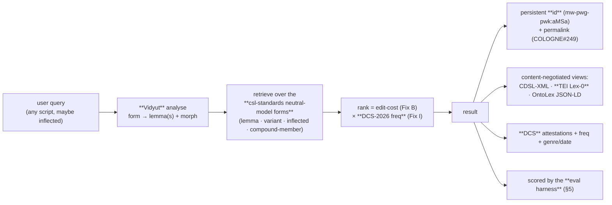

# simple-search — DH-grade roadmap (beyond v1.2)

For Jim, to implement from directly. This is the layer **above** the engine
fixes in [`roadmap_v1.2.md`](roadmap_v1.2.md) (Fixes A–I). v1.2 makes fuzzy
lookup *correct and ranked*; this file makes the search a **FAIR,
corpus-grounded, measurable discovery resource** that meets digital-humanities
standards.

The organising idea: **the search becomes the discovery/retrieval layer over
the `csl-standards` interoperability stack — it does not invent a new data
model.** `csl-standards` already defines a neutral JSON model between CDSL,
TEI (archival) and OntoLex (semantic), with stable entry IDs (e.g.
`mw-pwg-pwk:aMSa`), evidence classes, and loss reports
(`csl-standards/docs/INTEROPERABILITY_MODEL.md`,
`docs/PROJECT_SPEC.md`). simple-search consumes that; it is the Findable +
Accessible front door to the Interoperable + Reusable data.

## 0. Decisions locked (feedback round, 2026-06-11)

1. Pursue **all four** streams (A lemmatization, B corpus-grounding, C FAIR/LOD,
   D measured quality).
2. Interoperability target = **TEI Lex-0** (the archival TEI profile already
   chosen as the CDSL baseline in `csl-standards`), with OntoLex as the
   semantic mirror `csl-standards` already produces.
3. Morphology engine = **Vidyut** (Rust, fast, embeddable, Apache-2).
4. Build the **full evaluation harness** (gold set + precision@k / MRR). Done
   this round — see §5.

## 1. The picture — one query, four payoffs



Each stream is independent but they share this spine.

---

## 2. Stream A — lemmatization & sandhi-aware search (Vidyut)

**Problem.** Sanskrit is heavily inflected and glues words by sandhi and
compounding, so a user's query is often an inflected chunk of a longer form.
v1.1 matches *spelling*; it cannot resolve `gacchati` → `gam`, `rāmeṇa` →
`rāma`, or split `devarājaḥ` → `deva` + `rājan`. This is the single biggest
*functional* gap.

**Approach.** Add a pre-lookup analysis step using **Vidyut**
(`vidyut-prakriya` / `vidyut-cheda` for segmentation). Run it *only when the
plain lookup is thin* (0 results, or only low-score fuzzy hits), so the common
case stays fast.

Concrete endpoint behaviour — add `analyze=yes`:

    .../getword_list_1.0.php?dict=mw&input=iast&output=iast&key=gacchati&analyze=yes

Pipeline (new stage between `convert_nonascii` and the variant walk):

```text
key = "gacchati"
  -> vidyut.analyze("gacchati")  -> [{lemma:"gam", pos:"v", person:3, num:sg, tense:pres}]
  -> seed the Simple_Search with lemma "gam" (SLP1 "gam") IN ADDITION to the
     literal spelling, tagging each result with how it was reached.
```

**Expected output** (`key=gacchati&analyze=yes`):

```json
{
  "dict":"mw","input":"iast","output":"iast",
  "analysis":[{"form":"gacchati","lemma":"gam","pos":"v",
               "features":"3.sg.pres.P","engine":"vidyut"}],
  "result":[
    {"dicthw":"gam","dicthwoutput":"gam","via":"lemma:gacchati→gam",
     "score":1.0,"status":200}
  ]
}
```

For compounds, `vidyut-cheda` returns a segmentation; surface each member as
its own result with `via:"compound-member"`, so `devarājaḥ` finds both `deva`
and `rājan`.

**Notes.**
- Vidyut is a separate service/binary; call it over a thin local HTTP/CLI
  shim (it is not PHP). Cache analyses (the corpus tail is Zipfian).
- The csl-standards neutral model already enumerates `form` objects with
  `@type` lemma/inflected/compound-member — Stream A *populates the query side*
  of that same vocabulary.

**Questions:** A1 run Vidyut always, or only on thin results? A2 cap the number
of analyses fed into the variant walk? A3 host as a microservice or a batch
pre-expanded inflection table for the most frequent N lemmas?

---

## 3. Stream B — corpus-grounded results (DCS)

**Idea.** Turn a dictionary hit into *evidence*: show how the word actually
behaves in the corpus. The material exists already — `wf1/` gives frequency
(Fix I), and **VisualDCS** holds concordance examples
(`visual/conc_part*.json`, 6,423 forms × ≤5 examples), genre profiles
(`dcs_genres.json`), and diachronic points (`dcs_scatter.json`).

Add `corpus=yes`:

    .../getword_list_1.0.php?dict=mw&input=iast&output=iast&key=agni&corpus=yes

**Expected output** (per result element gains a `corpus` block):

```json
{
  "dicthw":"agni","dicthwoutput":"agni","status":200,
  "corpus":{
    "freq":295, "rank":412,
    "genres":[["Vedic",0.41],["Epic",0.22],["Śāstra",0.18]],
    "examples":[
      {"ref":"RV 1,1,1","text":"agnim īḷe purohitaṁ …"},
      {"ref":"MBh 1,1,1","text":"… agniṁ vāyuṁ ca …"}
    ]
  }
}
```

This also feeds the **`csl-standards` evidence model**: DCS attestations are
`frac:Attestation` nodes (OntoLex-FrAC), distinct from the dictionary's own
`<ls>` citations. Keep the two evidence sources labelled separately.

**Questions:** B1 inline `examples` in the search JSON, or a separate
`examples.php?id=…` call (payload size)? B2 join key — DCS `lemma_id` ↔ CDSL
headword via the bridge built for `wf1` (store the crosswalk where? a
`dcs_xref` table). B3 how many examples per result by default?

---

## 4. Stream C — FAIR / TEI Lex-0 / LOD spine (align with csl-standards)

**Do not duplicate `csl-standards`.** It owns the neutral model, the TEI
archival profile, and the OntoLex/FrAC graph. simple-search's FAIR job is the
*discovery + addressing* layer over it:

1. **Findable / citable id.** Every result already resolves to a CDSL
   headword; expose the neutral-model **`id`** (e.g. `mw:agni` / the merged
   `mw-pwg-pwk:agni`) and a permalink. This is exactly the clean-URL work in
   COLOGNE#249 — wire the search result's `id` to `/MW/agni`.
2. **Accessible / content negotiation.** One entry, several serializations the
   stack already produces — let the caller pick:

       .../entry/MW/agni            (default HTML)
       .../entry/MW/agni?format=tei      -> TEI Lex-0 XML
       .../entry/MW/agni?format=ontolex  -> OntoLex JSON-LD
       .../entry/MW/agni?format=cdsl     -> raw CDSL XML

3. **Interoperable / TEI Lex-0.** Target the **TEI Lex-0** baseline for the
   archival view (it is the agreed CDSL profile in `csl-standards`). Illustrative
   shape for `agni`:

```xml
<entry xml:id="mw-agni" type="mainEntry">
  <form type="lemma"><orth xml:lang="sa-Latn-x-slp1">agni</orth>
    <orth xml:lang="sa-Deva">अग्नि</orth></form>
  <gramGrp><gram type="pos">m</gram></gramGrp>
  <sense n="1"><def>fire, sacrificial fire</def>
    <cit type="generic-lexicographer"><bibl>L.</bibl></cit></sense>
  <note type="corpus-freq" source="DCS-2026">295</note>
</entry>
```

4. **Reusable / provenance + licence.** Each export carries source, version,
   and a `loss` pointer (the csl-standards model-adequacy status), so a reuser
   knows what was flattened.

**Questions:** C1 should simple-search *serve* the TEI/OntoLex (proxying
`csl-standards` output), or only *link* to the csl-standards workbench? C2 id
scheme — per-dictionary (`mw:agni`) or merged (`mw-pwg-pwk:agni`)? C3 confirm
TEI **Lex-0** profile (vs a looser TEI Dictionaries) as the strict target.

---

## 5. Stream D — measured-quality harness  (BUILT this round)

DH rigor = quality is *measured and reproducible*, not asserted. Shipped in
[`simple-search/eval/`](eval/):

- `gold.tsv` — gold set: `query · input · dict · intended_dicthw · note`.
- `eval_search.py` — scorer: **precision@1, recall@k, MRR**, and
  **mean result-count** (the overgeneration metric). Runs against the live API,
  or against `fixtures.json` when offline.
- `fixtures.json` — cached live responses (so the harness runs anywhere).
- `readme.md` — how to run + extend.

It turns "manas returns 20" into a number: **overgeneration = mean results per
query**, tracked against **recall** (did we still return the intended word?).
Use it to (a) set a baseline on v1.1, (b) gate Fixes A–I, (c) tune the Fix B
hard-drop `DELTA` by evidence.

**Baseline — v1.1 (wf0), seed gold set, 2026-06-11:**

```
ALL       n=16   P@1=0.94  recall@5=1.00  MRR=0.969  mean#results=5.25
default   n=12   P@1=0.92  recall@5=1.00  MRR=0.958  mean#results=6.67
precise   n=4    P@1=1.00  recall@5=1.00  MRR=1.000  mean#results=1.00
```

Recall is already perfect — the engine never *loses* the intended word. The
problem is **overgeneration**: `default` returns 6.7× more results than precise
(6.67 vs 1.00). The one ranking miss, `rama` → intended `rAma` at rank 2, is the
`put_user_word_first`-vs-frequency tension that `wf1` + Fix B should fix.
Targets for the v1.2 fixes: keep recall@5 ≥ 0.98 while default mean#results
falls from 6.67 toward ≤ 3.

**Questions:** D1 who curates the gold set's *full* relevant sets for ambiguous
queries (scholarly judgement)? D2 target thresholds — e.g. "recall@5 ≥ 0.98 AND
mean results ≤ 6"? D3 wire the harness into CI as a regression gate?

---

## 6. How the streams interlock

- A feeds B and D: a resolved lemma is the join key to DCS evidence and the
  unit the gold set scores.
- I (DCS freq) feeds B (same corpus) and Fix B ranking.
- C reuses A's forms (neutral-model `form@type`) and B's attestations
  (FrAC evidence).
- D measures all of them.

So the order below is about dependencies, not importance.

## 7. Suggested sequencing

| Phase | Stream | Depends on | Ship |
|---|---|---|---|
| P1 | **D** eval harness | — | done (§5) — baseline now |
| P2 | v1.2 Fixes A–I | D (to measure) | engine quality |
| P3 | **B** corpus-grounding | I, DCS bridge | evidence in results |
| P4 | **A** Vidyut lemmatization | service host | inflected/sandhi search |
| P5 | **C** FAIR/TEI/LOD | csl-standards, #249 | citable interop front door |

## 8. Questions (consolidated)

1. **Vidyut hosting** — microservice vs pre-expanded inflection table for the
   top-N frequent lemmas? (A1–A3)
2. **Corpus payload** — inline examples vs a separate `examples.php`? default
   example count? where to store the DCS↔CDSL crosswalk? (B1–B3)
3. **FAIR serving** — does simple-search serve TEI/OntoLex (proxy csl-standards)
   or only link to the workbench? id scheme? confirm TEI **Lex-0**. (C1–C3)
4. **Eval governance** — gold-set curation owner; target thresholds; CI gate?
   (D1–D3)
5. **Boundary with csl-standards** — agree which repo owns what: csl-standards =
   model + TEI/OntoLex + loss; simple-search = retrieve + rank + address +
   corpus-ground. Anything in between?
