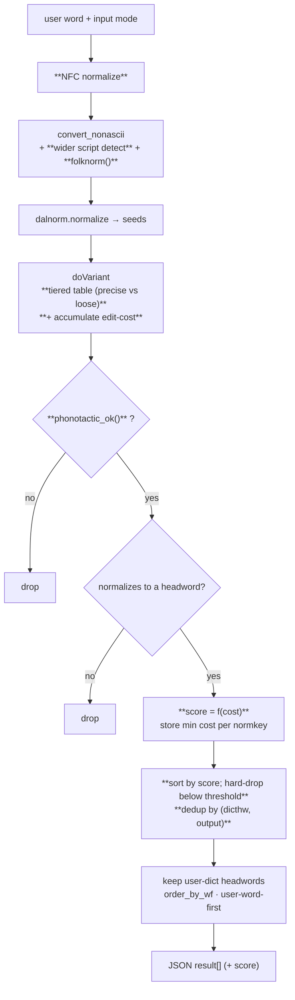

# simple-search v1.2 — implementation roadmap

This note is written for Jim (funderburkjim) to implement from directly. It
is the design feedback solicited in
[csl-apidev#26](https://github.com/sanskrit-lexicon/csl-apidev/issues/26)
("simple search, v1.1"): the v1.1 test build is live at
<https://sanskrit-lexicon.uni-koeln.de/simplet/> and is meant to replace
<https://sanskrit-lexicon.uni-koeln.de/simple/>. Everything below is a v1.2
proposal layered on the **frozen v1.1** code in `simple-search/v1.1/`.

All worked examples use the Monier-Williams dictionary (`dict=mw`) and the
live API endpoint
`.../simple-search/v1.1/getword_list_1.0.php`, e.g.

    https://www.sanskrit-lexicon.uni-koeln.de/scans/csl-apidev/simple-search/v1.1/getword_list_1.0.php?dict=mw&input=default&output=iast&key=manas

The companion `readme.org` in this folder explains the v1.1 pipeline; this
file is the change list.

---

## 0. Decisions already taken (feedback round, 2026-06-11)

These four are settled — the rewrites below assume them:

1. **Trust precise input.** When `input` is `slp1`, `deva` or `iast`, do
   **not** fuzz nasals or sibilants. The user who typed `ṣ` means `ṣ`.
   *Note (verified after the decision):* v1.1 **already** collapses precise
   input to the exact word via `restrict_to_user_word` whenever that word
   exists — so this decision mostly governs the *residual* case (precise
   spelling that is not itself a headword) plus an optional softening of that
   guard (see §4). The heavy lifting for overgeneration is §5 (default mode).
2. **Result policy = score + hard-drop.** Score every candidate by
   similarity to what the user typed, then *discard* anything below a
   confidence threshold (not merely reorder, not collapse-behind-"more").
3. **Add four input tracks:** loose-ASCII + case-folding; the non-Devanagari
   Brahmic scripts; WX + Velthuis; and ISO-15919 / NFC / combining-marks-on-
   capitals.
4. **Roadmap lives here**, `simple-search/roadmap_v1.2.md`.

---

## 1. Where v1.1 is today

The constructor of `Simple_Search` (in `v1.1/simple_search.php`) does the
work: it transcodes the user string to SLP1 (`convert_nonascii`), seeds the
search with that string and its hwnorm1c-normalized form, then walks the
string letter by letter substituting every member of a coarse
**equivalence table** (`transitionTable_default`), pruning only by "does
some headword start with this prefix" (`ngramValidate`). Each survivor is
multiplied again by ending- and grammar-variant rules, kept iff it
normalizes to a real headword, and finally ordered by corpus word frequency.
One late guard matters a lot: `restrict_to_user_word` (added 2021) returns
**only** the user's exact word when the input mode is *not* `default` and
that word exists. **So overgeneration is a `default`-mode problem** — precise
modes already self-limit.

Two things are wrong with that, and this roadmap fixes both.

Reproduce the symptom (each link returns JSON; watch the length of
`result`):

| URL (`...&output=iast&key=`) | `result` length |
|---|---|
| [`agni`](https://www.sanskrit-lexicon.uni-koeln.de/scans/csl-apidev/simple-search/v1.1/getword_list_1.0.php?dict=mw&input=default&output=iast&key=agni) | 1 |
| [`deva`](https://www.sanskrit-lexicon.uni-koeln.de/scans/csl-apidev/simple-search/v1.1/getword_list_1.0.php?dict=mw&input=default&output=iast&key=deva) | 5 |
| [`kara`](https://www.sanskrit-lexicon.uni-koeln.de/scans/csl-apidev/simple-search/v1.1/getword_list_1.0.php?dict=mw&input=default&output=iast&key=kara) | 11 |
| [`sana`](https://www.sanskrit-lexicon.uni-koeln.de/scans/csl-apidev/simple-search/v1.1/getword_list_1.0.php?dict=mw&input=default&output=iast&key=sana) | 18 |
| [`manas`](https://www.sanskrit-lexicon.uni-koeln.de/scans/csl-apidev/simple-search/v1.1/getword_list_1.0.php?dict=mw&input=default&output=iast&key=manas) | 20 |
| [`xqzqxq`](https://www.sanskrit-lexicon.uni-koeln.de/scans/csl-apidev/simple-search/v1.1/getword_list_1.0.php?dict=mw&input=default&output=iast&key=xqzqxq) | 0 |

All rows above are `input=default`. The *same* words under `input=iast`
each return **1** (`restrict_to_user_word`) — confirming overgeneration lives
in the loose/default front door, not the precise modes.

The target pipeline (new stages in **bold**):



---

## 2. Problem 1 — overgeneration (the evidence)

`manas` (20 results) is the clearest case. The list is almost entirely
nasal/sibilant swaps of one typed word — `manas, mAna, namas, nAma, nAman,
nAnA, mana, ...` — because the default table merges and swaps, at **every**
position and in **both** directions:

```php
// v1.1/simple_search.php, transitionTable_default
["n","Y","N","m","R","M"],   // 6 nasals, all interchangeable
["S","z","s","zh","sh"],     // all sibilants
["r","f","F","ri","ar","ru","rI","R","RI"],  // 9-way r-cluster
["b","B","v","V"],
```

There is no notion of *distance*: `ngramValidate` and `searchdict_add_basic`
ask only "does a headword like this exist?", so every coincidental real word
one swap away is returned with equal standing. Then
`generate_alternate_endings` and `grammar_variants` multiply each survivor
once more (this is why `deva` yields `devan` and `devf`).

---

## 3. Problem 2 — input coverage and case (the evidence)

`convert_nonascii` auto-detects only **Devanagari** and **Cyrillic**:

```php
// v1.1/simple_search.php (default branch, abridged)
$wordin1 = transcoder_processString($wordin,'deva','slp1');
if ($wordin1 != $wordin) { return $this->clean_slp1($wordin1); }       // Deva
$wordin1 = transcoder_processString($wordin,'cyrillic','slp1');
if ($wordin1 != $wordin) { return $this->clean_slp1($wordin1); }       // Cyrillic
$wordin0 = mb_strtolower($wordin, 'UTF-8');   // <-- folds ALL capitals
$wordin0 = $this->clean_default($wordin0);
$wordin1 = transcoder_processString($wordin0,'roman','slp1');
```

Gaps:

- **WX** has a table already — `utilities/transcoder/wx_slp1.xml` — but it is
  never wired into the input options.
- **Velthuis** (`aa ii .t "s .m`) has no table.
- **Other Brahmic scripts** (Bengali, Tamil/Grantha, Telugu, Kannada,
  Malayalam, Gujarati, …) have no tables; only Devanagari is present.
- **ISO-15919 marks** (`ṁ ē ō r̥`) and **decomposed Unicode** (combining
  ring/macron) can silently fail to transcode — no NFC pass.
- **Capital letters.** `mb_strtolower` is right for natural romanization
  (`Rāma = RAMA = rama`) but **lossy for the case-significant ASCII schemes**:
  HK/SLP1/upper-ITRANS use `T≠t`, `S≠s`, `R≠r`. In `default` mode those
  capitals are flattened before transcoding. A capital bearing a *combining*
  diacritic (`R̥`, decomposed `Ā`) also needs the NFC pass.

---

## 4. Fix A — tighten precise-mode residue + soften the exact-only guard

A *smaller* lever than it first appears: `restrict_to_user_word` already
returns exactly one result for precise input when the word exists (verified —
`input=iast&key=manas` → 1). Fix A covers the two cases that guard does
**not** help. (The headline overgeneration fix is §5, on `default` mode.)

**(A1) Residual fuzz when a precise spelling is *absent*** — a typo or an
inflected/sandhi form falls through to the still-broad
`transitionTable_slp1`. Give precise modes a tighter table. We can replace the
current "pick `_default` unless input isn't default":

```php
// v1.1: simple_search.php __construct
if ($this->input_simple == 'default') {
  $this->transitionTable = $this->transitionTable_default;
} else {
  $this->transitionTable = $this->transitionTable_slp1;
}
```

by a three-way choice, adding a new **precise** table:

```php
// v1.2
$precise = ['slp1','deva','iast'];   // user disambiguated already
if ($this->input_simple == 'default') {
  $this->transitionTable = $this->transitionTable_default;   // full fuzz
} elseif (in_array($this->input_simple, $precise)) {
  $this->transitionTable = $this->transitionTable_precise;   // NEW
} else {                                                     // hk, itrans
  $this->transitionTable = $this->transitionTable_slp1;
}
```

The new precise table keeps only the equivalences a *careful* typist still
gets wrong — vowel length, anusvāra vs homorganic nasal, visarga vs
s/r — and drops the nasal-merge, sibilant-merge and r-cross rows:

```php
// v1.2: simple_search.php  (NEW)
public $transitionTable_precise = [
  ["a","A"], ["i","I"], ["u","U"], ["o","O"], ["e","E"],
  ["M","m"],            // anusvāra <-> m only (NOT n/ṇ/ṅ/ñ)
  ["H"],               // visarga stays put under precise input
  ["f","F"],           // vocalic ṛ length only (NOT r/ri/ar/ru)
  ["x","X"],
  // consonants: identity (no k/kh, no b/v, no s/ś/ṣ merges)
];
```

**(A2) Soften `restrict_to_user_word` (optional, needs §5 scores).** Returning
*only* the exact word is blunt — it also hides homonyms and the close
candidate a user may have wanted after a one-character slip. Once §5 gives
every candidate a score, return the exact word **plus** anything inside the
hard-drop window, still exact-first:

```php
// v1.2: restrict_to_user_word — keep exact + near (was: exact only)
$result2 = array($ans1);                          // the exact word, first
foreach ($result1 as $r) {
  if ($r === $ans1) continue;
  if ($r['score'] >= $KEEP_SCORE) $result2[] = $r; // NEW: add scored near-matches
}
return $result2;
```

Example (the guard's current win — already correct in v1.1):

- <https://www.sanskrit-lexicon.uni-koeln.de/scans/csl-apidev/simple-search/v1.1/getword_list_1.0.php?dict=mw&input=iast&output=iast&key=manas> → **1** (`manas`)

**Expected output (v1.1 today, `input=iast&key=manas`):** the guard already
does the right thing —

```json
{ "dict":"mw","input":"iast","output":"iast","accent":"no",
  "result":[ {"dicthw":"manas","dicthwoutput":"manas","user_key_flag":true,"status":200} ] }
```

A2 would *add back* scored near-matches (e.g. `mānasa`) beneath the exact
word, rather than hiding them outright.

---

## 5. Fix B — similarity score + hard-drop threshold

Today every surviving variant is equal. In v1.2, give each transition-table
row a **cost** and accumulate it as `doVariant` substitutes, so each
candidate carries an edit-distance-like score. Then **hard-drop** anything
far from the best.

Add a cost parallel to the table (0 = identity/length, small = common
confusion, large = cross-class guess):

```php
// v1.2: cost per transitionTable row, same indices as $this->transitionTable
public $transitionCost_default = [
  0,0,0,0,0,        // vowel length pairs
  2,                // r-cluster cross members
  2,                // l-cluster
  1,                // nasals
  1,                // sibilants
  2,                // b/v
  /* ...one entry per row... */
];
```

Thread the cost through the recursion (only the signature and two lines
change):

```php
// v1.2: doVariant gains a running $cost
public function doVariant($pref,$word,$cost=0) {
  ...
  foreach($variants as $j=>$newChar) {
    $c = ($newChar === $varChar) ? 0 : $this->transitionCost[$itransition];
    $this->doVariant($pref.$newChar, $subWord, $cost + $c);
  }
  ...
}
// at bottom-out, keep the CHEAPEST path to each normkey:
$k = $this->dalnorm->normalize($pref);
if (!isset($this->searchcost[$k]) || $cost < $this->searchcost[$k]) {
  $this->searchcost[$k] = $cost;
}
```

After the walk, convert cost to a `score`, sort, and **drop** below a
threshold relative to the best — but never drop the user's own spelling:

```php
// v1.2: in generate_normkeys()
$best = min($this->searchcost);                 // smallest cost seen
$KEEP = $best + $DELTA;                          // hard-drop window (Q1)
foreach ($this->searchcost as $k=>$cost) {
  $isUser = ($k === $this->user_keyin_norm);
  if ($isUser || $cost <= $KEEP) {
    $this->normkeys[] = $k;
    $this->score[$k] = 1.0 / (1.0 + $cost);
  }
}
```

Expose `score` on each result object in `getword_list_1.0_main.php` so the
ordering is transparent to the front-end and to sanlex-vue.

**Expected output (v1.2, `input=default&key=kara`):** the 11-way list keeps
the exact word and its closest neighbours; far guesses like `krA`, `KAra`,
`kArA` fall below `best + DELTA` and are dropped server-side.

```json
{
  "dict": "mw", "input": "default", "output": "iast", "accent": "no",
  "result": [
    { "dicthw": "kara",  "dicthwoutput": "kara",            "score": 1.0,  "user_key_flag": true },
    { "dicthw": "kAra",  "dicthwoutput": "kāra",            "score": 0.5,  "user_key_flag": false },
    { "dicthw": "kaRa",  "dicthwoutput": "kara (ṇ)",        "score": 0.5,  "user_key_flag": false }
  ]
}
```

---

## 6. Fix C — phonotactic / sandhi pruning

Many fabricated forms are not just unlikely, they are **impossible** Sanskrit
— yet they survive because a real but unrelated headword shares their prefix.
Add a cheap, high-precision filter applied *before* the existence check, in
`searchdict_add_basic`:

```php
// v1.2 (NEW)  word is slp1
public function phonotactic_ok($word) {
  // a. word-initial ṅ (N) or ṇ (R) does not occur in native vocabulary
  if (preg_match('/^[NR]/', $word)) return false;
  // b. retroflex ṇ (R) needs a nati trigger (r/ṛ/ṣ/k...) earlier in the word
  if (strpos($word,'R')!==false && !preg_match('/[rfzkSK].*R/', $word)) return false;
  // ...start conservative; extend as exceptions are vetted (Q8)
  return true;
}
```

Wire it in:

```php
// v1.2: searchdict_add_basic
public function searchdict_add_basic($k0) {
  if (!$this->phonotactic_ok($k0)) return;       // NEW
  $k = $this->dalnorm->normalize($k0);
  ...
}
```

Example to watch (`naman`/`maRa`-type fabrications disappear):
<https://www.sanskrit-lexicon.uni-koeln.de/scans/csl-apidev/simple-search/v1.1/getword_list_1.0.php?dict=mw&input=default&output=iast&key=manas>

---

## 7. Fix D — result hygiene (dedup, flags)

The live `manas` list shows what looks like a repeated surface headword. Two
distinct normalized keys can resolve to the same `dicthw` in the user's
dictionary. Add a final dedup keyed on the *displayed* form:

```php
// v1.2: getword_list_1.0_main.php, after building $result2
$seen = [];
$result3 = [];
foreach ($result2 as $r) {
  $sig = $r['dicthw'] . '|' . $r['dicthwoutput'];
  if (isset($seen[$sig])) continue;             // NEW
  $seen[$sig] = true;
  $result3[] = $r;
}
$ans['result'] = $result3;
```

**Expected output:** no two result objects with identical
`(dicthw, dicthwoutput)`.

---

## 8. Fix E — NFC + case + wider script auto-detect

Three small, independent edits to `convert_nonascii`.

**(E1) NFC**, first thing in the default branch:

```php
// v1.2 (NEW)
if (class_exists('Normalizer')) {              // PHP intl (Q7)
  $wordin = Normalizer::normalize($wordin, Normalizer::FORM_C);
}
```

**(E2) Wider non-ASCII detection.** Only **non-ASCII** scripts can be
auto-detected (ASCII schemes overlap — see E3). Generalize the deva/cyrillic
ladder:

```php
// v1.2: replace the two hard-coded probes with a loop
foreach (['deva','cyrillic','beng','taml','telu','knda','mlym','gujr'] as $scheme) {
  $w = transcoder_processString($wordin, $scheme, 'slp1');
  if ($w != $wordin) { return $this->clean_slp1($w); }
}
```

**(E3) Case policy is explicit, not magic.** Keep `mb_strtolower` on the
default/roman path (so `Rāma = RAMA = rama`), but the **case-significant ASCII
schemes** (HK, SLP1, WX, Velthuis, upper-ITRANS) must stay **explicit input
options** — they cannot be reliably distinguished from each other or from
loose ASCII (Q5, Q10). So `wx` and `velthuis` are added to the input
`<select>` in `list-0.2s_rw.php`, *not* to the detect loop above.

Example (decomposed `ṛ` = `r` + U+0325 now matches precomposed):
<https://www.sanskrit-lexicon.uni-koeln.de/scans/csl-apidev/simple-search/v1.1/getword_list_1.0.php?dict=mw&input=iast&output=iast&key=kr%CC%A5ta>

---

## 9. Fix F — folk-ASCII pre-normalizer (the default front door)

Replace the scattered `clean_default` hacks with one documented mapping that
turns common folk spelling into SLP1 *before* `roman->slp1`. This reduces how
much the fuzzy table has to do.

We can replace:

```php
// v1.1: clean_default
$word1 = preg_replace('|w|','v',$word);
$word1 = preg_replace('|f|','p',$word1);
$word1 = preg_replace('|x|','z',$word1);   // xenophobe
$word1 = preg_replace('|oo|','u',$word1);
$word1 = preg_replace('|ou|','o',$word1);
$word1 = preg_replace('|f|','ph',$word1);  // dead (f already gone)
```

by an explicit `folknorm` (lower-cased ASCII in, near-SLP1 out):

```php
// v1.2 (NEW)
public function folknorm($w) {
  $w = preg_replace('/chh/','C',$w);                 // छ
  $w = preg_replace('/ch/','c',$w);                  // च
  $w = preg_replace('/sh/','S',$w);                  // श  (vs ष — table fuzzes)
  $w = preg_replace('/(ksh|x)/','kz',$w);            // क्ष  (Q2: x vs z)
  $w = preg_replace('/(gya|dnya|dny|jna)/','jYa',$w);// ज्ञ  (gya/dnya/jña)
  $w = preg_replace('/aa/','A',$w);
  $w = preg_replace('/ee/','I',$w);
  $w = preg_replace('/oo/','U',$w);
  $w = preg_replace('/ri/','f',$w);                  // ऋ (onset; Q2)
  $w = preg_replace('/w/','v',$w);
  $w = preg_replace('/(.)\1/','$1',$w);              // collapse doubles
  return $w;
}
```

Example (`Kr̥ṣṇa` typed as folk `krishna` / `krushna` / `kRShNa`):
<https://www.sanskrit-lexicon.uni-koeln.de/scans/csl-apidev/simple-search/v1.1/getword_list_1.0.php?dict=mw&input=default&output=iast&key=krishna>

**Expected output:** `krishna`, `krushna`, `kRShNa` and `kRSNa` all reach
`kfzRa` (कृष्ण) as the top-scored result.

---

## 10. Fix G — new transcoder tables (WX, Velthuis, Brahmic)

Inventory of `utilities/transcoder/` and what is needed:

| Scheme | Table today | Action |
|---|---|---|
| WX | `wx_slp1.xml` ✅ | wire into input `<select>` only |
| Velthuis | — | add `velthuis_slp1.xml`, add to `<select>` |
| Bengali | — | add `beng_slp1.xml`, add to detect loop (E2) |
| Tamil/Grantha | — | add `taml_slp1.xml` (+ Grantha) |
| Telugu/Kannada/Malayalam/Gujarati | — | add `*_slp1.xml` |

Mappings for these scripts already exist upstream in the wider Cologne /
sanscript ecosystem; this is table-porting, not linguistics. Sequence by
real user demand (Q6).

---

## 11. Fix H — index-side "blur-key" retrieval (optional, scalable)

The current engine *generates* thousands of candidate strings and probes each
against the database. The repo already contains the parts for the inverse,
cheaper approach in `simple-search/simpleslp/`:

- `simpleslp1.py` computes a **blurred spelling** (`simpleslp1`) for every
  hwnorm1c headword (lower-case, undouble, nasals→n, ṛ→r, ś/ṣ→s, …).
- `make_sqlite_fts.py` builds an FTS index over those blurred spellings.

v1.2-H reframes the whole search: compute the **input's** blur key once,
issue **one** FTS lookup, then rank the returned headwords by true edit
distance to the input (reusing the Fix B cost model). This replaces
"generate-and-test" with "retrieve-and-rank" and scales to the full lexicon
without the combinatorial walk. Treat as a separate, later milestone (Q9).

---

## 12. Suggested sequencing

| Milestone | Fixes | Effect | New data? |
|---|---|---|---|
| **M1** hygiene | D (dedup), E1 (NFC), A1 (precise-residue table) | correctness; smaller precise-*absent* lists (precise+exact is already 1) | none |
| **M2** ranking — headline | B (score + hard-drop), expose `score`, A2 (soften guard) | tames `default`-mode overgeneration — the actual problem | none |
| **M3** precision | C (phonotactics), F (folknorm) | further `default`-mode noise drop | none |
| **M4** coverage | E2/E3 (detect + case), G (WX, Velthuis, Brahmic) | many more spellings accepted | new tables |
| **M5** scale | H (blur-key index) | retrieve-and-rank rewrite | rebuild index |

**M2 is the change that answers the #26 feedback** — it shrinks and ranks the
long `default`-mode lists entirely server-side (no front-end change). M1 is
low-risk correctness you can ship first.

---

## 13. Expected-output reference (before → after)

`input=default&key=manas`, MW:

```text
v1.1:  20 results  (manas, mAna, namas, nAma, nAman, nAnA, mana, ... )
v1.2:  ~4 results  (manas [1.0], mAnasa [0.55], namas [0.5], mAna [0.5])
                    — phonotactic + score-drop remove the ṇ/ṅ/ñ fabrications
```

`input=iast&key=manas`, MW (precise mode):

```text
v1.1:  1 result    (manas)            — restrict_to_user_word already collapses it
v1.2:  1–2 results (manas, +mAnasa)   — unchanged unless A2 softens the guard to
                                         surface scored near-matches beneath it
```

---

## 14. Questions

1. **Hard-drop window.** What `DELTA` (max cost above the best to keep) and
   floor count `N`? Confirm we always keep the user's exact spelling even if
   it would otherwise be the only survivor.
2. **`x` conflict.** Folk Sanskrit wants `x → kṣ`; v1.1 `clean_default` maps
   `x → z` for foreign words (`xenophobe`). Which wins in `default` mode?
3. **`sh` bias.** `sh → ś` or `→ ṣ` as the default before the table fuzzes
   the rest? (`ś` is more common.)
4. **JSON contract.** OK to add `score` to each result object? Any consumer
   besides `list-0.2s_rw.php` and sanlex-vue that parses this shape?
5. **WX / Velthuis as explicit modes.** Confirm they go in the input
   `<select>` (not auto-detect), since ASCII schemes are mutually ambiguous.
6. **Brahmic priority + codepoint overlap.** Which scripts first, and is
   there any pair whose ranges collide in the detect loop ordering?
7. **PHP intl.** Is the `Normalizer` class available on the Cologne server
   (needed for the NFC pass in Fix E1)?
8. **Phonotactic exceptions.** Start with only the two safe rules
   (word-initial ṅ/ṇ; ṣ/ṇ nati trigger)? Any loanword/headword counter-
   examples in hwnorm1c we should whitelist first?
9. **Index-side rewrite (Fix H).** Worth doing, or is generate-and-test fast
   enough at current scale? (Need timing on the slowest queries.)
10. **Case-significant ASCII.** Acceptable that HK/SLP1 capitals are folded
    when typed in `default` mode (user must pick the right mode), or do you
    want a heuristic guess?
